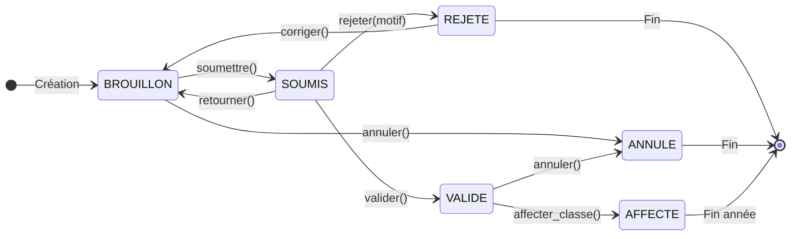
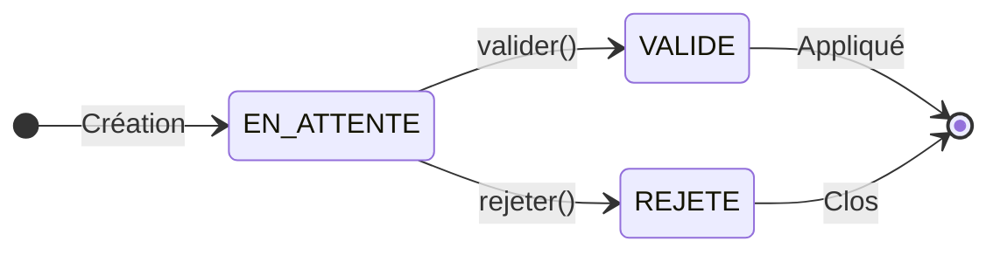
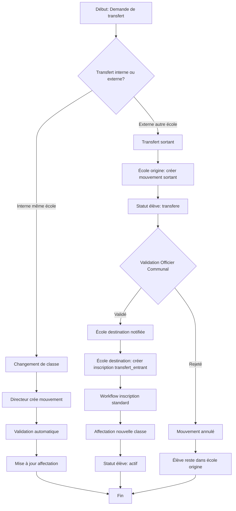

# Documentation Technique - Module de Gestion des Inscriptions des Élèves

**Système:** NEMS (National Education Management System)
**Version:** 1.0.0
**Date:** 2026-02-02
**Statut:** Production-ready

---

## Table des matières

1. [Modèle de données](#1-modèle-de-données)
2. [Migrations Laravel](#2-migrations-laravel)
3. [Permissions spécifiques](#3-permissions-spécifiques)
4. [Policies Laravel](#4-policies-laravel)
5. [HasDataScope](#5-hasdatascope)
6. [Règles de gestion métier](#6-règles-de-gestion-métier)
7. [Endpoints API REST](#7-endpoints-api-rest)
8. [Schémas UML](#8-schémas-uml)
9. [Audit Trail](#9-audit-trail)
10. [Protection des données personnelles](#10-protection-des-données-personnelles)

---

## 1. Modèle de données

### 1.1 Vue d'ensemble des entités

```
┌─────────────────────────────────────────────────────────────────────────────┐
│                        MODÈLE DE DONNÉES - INSCRIPTIONS                      │
├─────────────────────────────────────────────────────────────────────────────┤
│                                                                              │
│  ┌──────────────────┐     ┌──────────────────┐     ┌──────────────────┐    │
│  │  annee_scolaires │────▶│    campagnes     │────▶│   inscriptions   │    │
│  └──────────────────┘     │   _inscription   │     └────────┬─────────┘    │
│                           └──────────────────┘              │              │
│                                                             │              │
│  ┌──────────────────┐                                       │              │
│  │     eleves       │◀──────────────────────────────────────┘              │
│  └────────┬─────────┘                                                      │
│           │                                                                 │
│           ▼                                                                 │
│  ┌──────────────────┐     ┌──────────────────┐                             │
│  │  affectations    │────▶│     classes      │                             │
│  │    _classe       │     └──────────────────┘                             │
│  └──────────────────┘                                                      │
│                                                                             │
│  ┌──────────────────┐                                                      │
│  │   mouvements     │  (Historique: transferts, abandons, décès, etc.)     │
│  │    _eleve        │                                                      │
│  └──────────────────┘                                                      │
│                                                                             │
└─────────────────────────────────────────────────────────────────────────────┘
```

### 1.2 Tables principales

#### Table `annee_scolaires`

| Colonne      | Type            | Contraintes        | Description                    |
| ------------ | --------------- | ------------------ | ------------------------------ |
| `id`         | BIGINT UNSIGNED | PK, AUTO_INCREMENT | Identifiant unique             |
| `code`       | VARCHAR(20)     | UNIQUE, NOT NULL   | Ex: "2025-2026"                |
| `libelle`    | VARCHAR(100)    | NOT NULL           | Ex: "Année Scolaire 2025-2026" |
| `date_debut` | DATE            | NOT NULL           | Date de début                  |
| `date_fin`   | DATE            | NOT NULL           | Date de fin                    |
| `est_active` | BOOLEAN         | DEFAULT false      | Année en cours                 |
| `created_at` | TIMESTAMP       |                    |                                |
| `updated_at` | TIMESTAMP       |                    |                                |

#### Table `campagnes_inscription`

| Colonne             | Type            | Contraintes        | Description                        |
| ------------------- | --------------- | ------------------ | ---------------------------------- |
| `id`                | BIGINT UNSIGNED | PK, AUTO_INCREMENT | Identifiant unique                 |
| `annee_scolaire_id` | BIGINT UNSIGNED | FK, NOT NULL       | Référence année                    |
| `school_id`          | BIGINT UNSIGNED | FK, NOT NULL       | École concernée                    |
| `type`              | ENUM            | NOT NULL           | 'nouvelle', 'reinscription'        |
| `date_ouverture`    | DATE            | NOT NULL           | Début campagne                     |
| `date_cloture`      | DATE            | NOT NULL           | Fin campagne                       |
| `statut`            | ENUM            | NOT NULL           | 'planifiee', 'ouverte', 'cloturee' |
| `quota_max`         | INT UNSIGNED    | NULLABLE           | Limite d'inscriptions              |
| `created_by`        | BIGINT UNSIGNED | FK                 | Créateur                           |
| `created_at`        | TIMESTAMP       |                    |                                    |
| `updated_at`        | TIMESTAMP       |                    |                                    |

#### Table `eleves`

| Colonne              | Type            | Contraintes          | Description                                            |
| -------------------- | --------------- | -------------------- | ------------------------------------------------------ |
| `id`                 | BIGINT UNSIGNED | PK, AUTO_INCREMENT   | Identifiant unique                                     |
| `matricule`          | VARCHAR(20)     | UNIQUE, NOT NULL     | Matricule national unique                              |
| `nom`                | VARCHAR(100)    | NOT NULL             | Nom de famille                                         |
| `prenom`             | VARCHAR(100)    | NOT NULL             | Prénom(s)                                              |
| `sexe`               | ENUM('M', 'F')  | NOT NULL             | Genre                                                  |
| `date_naissance`     | DATE            | NOT NULL             | Date de naissance                                      |
| `lieu_naissance`     | VARCHAR(150)    | NOT NULL             | Lieu de naissance                                      |
| `nationalite`        | VARCHAR(50)     | DEFAULT 'Burundaise' | Nationalité                                            |
| `colline_origine_id` | BIGINT UNSIGNED | FK, NULLABLE         | Colline d'origine                                      |
| `adresse`            | TEXT            | NULLABLE             | Adresse complète                                       |
| `nom_pere`           | VARCHAR(200)    | NULLABLE             | Nom du père                                            |
| `nom_mere`           | VARCHAR(200)    | NULLABLE             | Nom de la mère                                         |
| `contact_tuteur`     | VARCHAR(20)     | NULLABLE             | Téléphone tuteur                                       |
| `nom_tuteur`         | VARCHAR(200)    | NULLABLE             | Nom du tuteur                                          |
| `photo_path`         | VARCHAR(255)    | NULLABLE             | Chemin photo (chiffré)                                 |
| `est_orphelin`       | BOOLEAN         | DEFAULT false        | Statut orphelin                                        |
| `a_handicap`         | BOOLEAN         | DEFAULT false        | Situation handicap                                     |
| `type_handicap`      | VARCHAR(100)    | NULLABLE             | Description handicap                                   |
| `ecole_origine_id`   | BIGINT UNSIGNED | FK, NULLABLE         | Première école                                         |
| `statut_global`      | ENUM            | DEFAULT 'actif'      | 'actif', 'inactif', 'transfere', 'abandonne', 'decede' |
| `deleted_at`         | TIMESTAMP       | NULLABLE             | Soft delete                                            |
| `created_at`         | TIMESTAMP       |                      |                                                        |
| `updated_at`         | TIMESTAMP       |                      |                                                        |

#### Table `inscriptions`

| Colonne              | Type            | Contraintes        | Description                                         |
| -------------------- | --------------- | ------------------ | --------------------------------------------------- |
| `id`                 | BIGINT UNSIGNED | PK, AUTO_INCREMENT | Identifiant unique                                  |
| `numero_inscription` | VARCHAR(30)     | UNIQUE, NOT NULL   | Numéro unique par année                             |
| `eleve_id`           | BIGINT UNSIGNED | FK, NOT NULL       | Référence élève                                     |
| `campagne_id`        | BIGINT UNSIGNED | FK, NOT NULL       | Référence campagne                                  |
| `annee_scolaire_id`  | BIGINT UNSIGNED | FK, NOT NULL       | Année scolaire                                      |
| `school_id`           | BIGINT UNSIGNED | FK, NOT NULL       | École d'inscription                                 |
| `niveau_demande_id`  | BIGINT UNSIGNED | FK, NOT NULL       | Niveau demandé                                      |
| `type_inscription`   | ENUM            | NOT NULL           | 'nouvelle', 'reinscription', 'transfert_entrant'    |
| `statut`             | ENUM            | NOT NULL           | 'brouillon', 'soumis', 'valide', 'rejete', 'annule' |
| `date_inscription`   | DATE            | NOT NULL           | Date d'inscription                                  |
| `date_soumission`    | TIMESTAMP       | NULLABLE           | Date soumission                                     |
| `date_validation`    | TIMESTAMP       | NULLABLE           | Date validation                                     |
| `motif_rejet`        | TEXT            | NULLABLE           | Raison si rejeté                                    |
| `est_redoublant`     | BOOLEAN         | DEFAULT false      | Redoublement                                        |
| `pieces_fournies`    | JSON            | NULLABLE           | Liste pièces justificatives                         |
| `observations`       | TEXT            | NULLABLE           | Notes diverses                                      |
| `soumis_par`         | BIGINT UNSIGNED | FK, NULLABLE       | Utilisateur soumetteur                              |
| `valide_par`         | BIGINT UNSIGNED | FK, NULLABLE       | Validateur                                          |
| `created_by`         | BIGINT UNSIGNED | FK                 | Créateur                                            |
| `created_at`         | TIMESTAMP       |                    |                                                     |
| `updated_at`         | TIMESTAMP       |                    |                                                     |

**Contrainte unique:** `UNIQUE(eleve_id, annee_scolaire_id)` - Un élève ne peut avoir qu'une inscription par année.

#### Table `classes`

| Colonne                   | Type            | Contraintes        | Description        |
| ------------------------- | --------------- | ------------------ | ------------------ |
| `id`                      | BIGINT UNSIGNED | PK, AUTO_INCREMENT | Identifiant unique |
| `code`                    | VARCHAR(20)     | NOT NULL           | Ex: "6A", "5B"     |
| `libelle`                 | VARCHAR(100)    | NOT NULL           | Nom complet        |
| `school_id`                | BIGINT UNSIGNED | FK, NOT NULL       | École              |
| `niveau_id`               | BIGINT UNSIGNED | FK, NOT NULL       | Niveau scolaire    |
| `annee_scolaire_id`       | BIGINT UNSIGNED | FK, NOT NULL       | Année              |
| `capacite_max`            | INT UNSIGNED    | NOT NULL           | Capacité maximale  |
| `enseignant_principal_id` | BIGINT UNSIGNED | FK, NULLABLE       | Titulaire          |
| `salle`                   | VARCHAR(50)     | NULLABLE           | Local              |
| `est_active`              | BOOLEAN         | DEFAULT true       | Statut             |
| `created_at`              | TIMESTAMP       |                    |                    |
| `updated_at`              | TIMESTAMP       |                    |                    |

#### Table `affectations_classe`

| Colonne            | Type            | Contraintes        | Description           |
| ------------------ | --------------- | ------------------ | --------------------- |
| `id`               | BIGINT UNSIGNED | PK, AUTO_INCREMENT | Identifiant unique    |
| `inscription_id`   | BIGINT UNSIGNED | FK, NOT NULL       | Référence inscription |
| `classe_id`        | BIGINT UNSIGNED | FK, NOT NULL       | Classe affectée       |
| `date_affectation` | DATE            | NOT NULL           | Date d'affectation    |
| `date_fin`         | DATE            | NULLABLE           | Fin si changement     |
| `est_active`       | BOOLEAN         | DEFAULT true       | Affectation courante  |
| `numero_ordre`     | INT UNSIGNED    | NULLABLE           | Numéro dans la classe |
| `motif_changement` | VARCHAR(255)    | NULLABLE           | Si réaffectation      |
| `affecte_par`      | BIGINT UNSIGNED | FK                 | Utilisateur           |
| `created_at`       | TIMESTAMP       |                    |                       |
| `updated_at`       | TIMESTAMP       |                    |                       |

#### Table `mouvements_eleve`

| Colonne                | Type            | Contraintes          | Description                      |
| ---------------------- | --------------- | -------------------- | -------------------------------- |
| `id`                   | BIGINT UNSIGNED | PK, AUTO_INCREMENT   | Identifiant unique               |
| `eleve_id`             | BIGINT UNSIGNED | FK, NOT NULL         | Élève concerné                   |
| `annee_scolaire_id`    | BIGINT UNSIGNED | FK, NOT NULL         | Année du mouvement               |
| `type_mouvement`       | ENUM            | NOT NULL             | Voir liste ci-dessous            |
| `date_mouvement`       | DATE            | NOT NULL             | Date effective                   |
| `ecole_origine_id`     | BIGINT UNSIGNED | FK, NULLABLE         | École de départ                  |
| `ecole_destination_id` | BIGINT UNSIGNED | FK, NULLABLE         | École d'arrivée                  |
| `classe_origine_id`    | BIGINT UNSIGNED | FK, NULLABLE         | Classe de départ                 |
| `motif`                | TEXT            | NOT NULL             | Justification                    |
| `document_reference`   | VARCHAR(255)    | NULLABLE             | Référence pièce                  |
| `document_path`        | VARCHAR(255)    | NULLABLE             | Fichier scanné                   |
| `statut`               | ENUM            | DEFAULT 'en_attente' | 'en_attente', 'valide', 'rejete' |
| `valide_par`           | BIGINT UNSIGNED | FK, NULLABLE         | Validateur                       |
| `date_validation`      | TIMESTAMP       | NULLABLE             | Date validation                  |
| `observations`         | TEXT            | NULLABLE             | Notes                            |
| `created_by`           | BIGINT UNSIGNED | FK                   | Créateur                         |
| `created_at`           | TIMESTAMP       |                      |                                  |
| `updated_at`           | TIMESTAMP       |                      |                                  |

**Types de mouvement:**

- `transfert_sortant` : Élève quitte l'école
- `transfert_entrant` : Élève arrive d'une autre école
- `abandon` : Abandon scolaire
- `exclusion` : Exclusion disciplinaire
- `deces` : Décès de l'élève
- `passage` : Passage au niveau supérieur
- `redoublement` : Redoublement décidé
- `reintegration` : Retour après abandon

#### Table `niveaux_scolaires`

| Colonne      | Type            | Contraintes        | Description                             |
| ------------ | --------------- | ------------------ | --------------------------------------- |
| `id`         | BIGINT UNSIGNED | PK, AUTO_INCREMENT | Identifiant unique                      |
| `code`       | VARCHAR(10)     | UNIQUE, NOT NULL   | Ex: "1P", "6F"                          |
| `libelle`    | VARCHAR(100)    | NOT NULL           | Ex: "1ère Primaire"                     |
| `cycle`      | ENUM            | NOT NULL           | 'prescolaire', 'primaire', 'secondaire' |
| `ordre`      | INT UNSIGNED    | NOT NULL           | Ordre de progression                    |
| `est_actif`  | BOOLEAN         | DEFAULT true       | Actif                                   |
| `created_at` | TIMESTAMP       |                    |                                         |
| `updated_at` | TIMESTAMP       |                    |                                         |

---

## 2. Migrations Laravel

### 2.1 Migration: annee_scolaires

```php
<?php

use Illuminate\Database\Migrations\Migration;
use Illuminate\Database\Schema\Blueprint;
use Illuminate\Support\Facades\Schema;

return new class extends Migration
{
    public function up(): void
    {
        Schema::create('annee_scolaires', function (Blueprint $table) {
            $table->id();
            $table->string('code', 20)->unique();
            $table->string('libelle', 100);
            $table->date('date_debut');
            $table->date('date_fin');
            $table->boolean('est_active')->default(false);
            $table->timestamps();

            $table->index('est_active');
            $table->index(['date_debut', 'date_fin']);
        });
    }

    public function down(): void
    {
        Schema::dropIfExists('annee_scolaires');
    }
};
```

### 2.2 Migration: niveaux_scolaires

```php
<?php

use Illuminate\Database\Migrations\Migration;
use Illuminate\Database\Schema\Blueprint;
use Illuminate\Support\Facades\Schema;

return new class extends Migration
{
    public function up(): void
    {
        Schema::create('niveaux_scolaires', function (Blueprint $table) {
            $table->id();
            $table->string('code', 10)->unique();
            $table->string('libelle', 100);
            $table->enum('cycle', ['prescolaire', 'primaire', 'secondaire']);
            $table->unsignedInteger('ordre');
            $table->boolean('est_actif')->default(true);
            $table->timestamps();

            $table->index('cycle');
            $table->index('ordre');
        });
    }

    public function down(): void
    {
        Schema::dropIfExists('niveaux_scolaires');
    }
};
```

### 2.3 Migration: campagnes_inscription

```php
<?php

use Illuminate\Database\Migrations\Migration;
use Illuminate\Database\Schema\Blueprint;
use Illuminate\Support\Facades\Schema;

return new class extends Migration
{
    public function up(): void
    {
        Schema::create('campagnes_inscription', function (Blueprint $table) {
            $table->id();
            $table->foreignId('annee_scolaire_id')
                ->constrained('annee_scolaires')
                ->cascadeOnDelete();
            $table->foreignId('school_id')
                ->constrained('ecoles')
                ->cascadeOnDelete();
            $table->enum('type', ['nouvelle', 'reinscription']);
            $table->date('date_ouverture');
            $table->date('date_cloture');
            $table->enum('statut', ['planifiee', 'ouverte', 'cloturee'])
                ->default('planifiee');
            $table->unsignedInteger('quota_max')->nullable();
            $table->foreignId('created_by')
                ->nullable()
                ->constrained('users')
                ->nullOnDelete();
            $table->timestamps();

            $table->index(['annee_scolaire_id', 'school_id']);
            $table->index('statut');
        });
    }

    public function down(): void
    {
        Schema::dropIfExists('campagnes_inscription');
    }
};
```

### 2.4 Migration: eleves

```php
<?php

use Illuminate\Database\Migrations\Migration;
use Illuminate\Database\Schema\Blueprint;
use Illuminate\Support\Facades\Schema;

return new class extends Migration
{
    public function up(): void
    {
        Schema::create('eleves', function (Blueprint $table) {
            $table->id();
            $table->string('matricule', 20)->unique();
            $table->string('nom', 100);
            $table->string('prenom', 100);
            $table->enum('sexe', ['M', 'F']);
            $table->date('date_naissance');
            $table->string('lieu_naissance', 150);
            $table->string('nationalite', 50)->default('Burundaise');
            $table->foreignId('colline_origine_id')
                ->nullable()
                ->constrained('collines')
                ->nullOnDelete();
            $table->text('adresse')->nullable();
            $table->string('nom_pere', 200)->nullable();
            $table->string('nom_mere', 200)->nullable();
            $table->string('contact_tuteur', 20)->nullable();
            $table->string('nom_tuteur', 200)->nullable();
            $table->string('photo_path', 255)->nullable();
            $table->boolean('est_orphelin')->default(false);
            $table->boolean('a_handicap')->default(false);
            $table->string('type_handicap', 100)->nullable();
            $table->foreignId('ecole_origine_id')
                ->nullable()
                ->constrained('ecoles')
                ->nullOnDelete();
            $table->enum('statut_global', [
                'actif', 'inactif', 'transfere', 'abandonne', 'decede'
            ])->default('actif');
            $table->softDeletes();
            $table->timestamps();

            $table->index('matricule');
            $table->index(['nom', 'prenom']);
            $table->index('statut_global');
            $table->fullText(['nom', 'prenom', 'matricule']);
        });
    }

    public function down(): void
    {
        Schema::dropIfExists('eleves');
    }
};
```

### 2.5 Migration: inscriptions

```php
<?php

use Illuminate\Database\Migrations\Migration;
use Illuminate\Database\Schema\Blueprint;
use Illuminate\Support\Facades\Schema;

return new class extends Migration
{
    public function up(): void
    {
        Schema::create('inscriptions', function (Blueprint $table) {
            $table->id();
            $table->string('numero_inscription', 30)->unique();
            $table->foreignId('eleve_id')
                ->constrained('eleves')
                ->cascadeOnDelete();
            $table->foreignId('campagne_id')
                ->constrained('campagnes_inscription')
                ->cascadeOnDelete();
            $table->foreignId('annee_scolaire_id')
                ->constrained('annee_scolaires')
                ->cascadeOnDelete();
            $table->foreignId('school_id')
                ->constrained('ecoles')
                ->cascadeOnDelete();
            $table->foreignId('niveau_demande_id')
                ->constrained('niveaux_scolaires')
                ->cascadeOnDelete();
            $table->enum('type_inscription', [
                'nouvelle', 'reinscription', 'transfert_entrant'
            ]);
            $table->enum('statut', [
                'brouillon', 'soumis', 'valide', 'rejete', 'annule'
            ])->default('brouillon');
            $table->date('date_inscription');
            $table->timestamp('date_soumission')->nullable();
            $table->timestamp('date_validation')->nullable();
            $table->text('motif_rejet')->nullable();
            $table->boolean('est_redoublant')->default(false);
            $table->json('pieces_fournies')->nullable();
            $table->text('observations')->nullable();
            $table->foreignId('soumis_par')
                ->nullable()
                ->constrained('users')
                ->nullOnDelete();
            $table->foreignId('valide_par')
                ->nullable()
                ->constrained('users')
                ->nullOnDelete();
            $table->foreignId('created_by')
                ->nullable()
                ->constrained('users')
                ->nullOnDelete();
            $table->timestamps();

            $table->unique(['eleve_id', 'annee_scolaire_id']);
            $table->index('statut');
            $table->index(['school_id', 'annee_scolaire_id']);
        });
    }

    public function down(): void
    {
        Schema::dropIfExists('inscriptions');
    }
};
```

### 2.6 Migration: classes

```php
<?php

use Illuminate\Database\Migrations\Migration;
use Illuminate\Database\Schema\Blueprint;
use Illuminate\Support\Facades\Schema;

return new class extends Migration
{
    public function up(): void
    {
        Schema::create('classes', function (Blueprint $table) {
            $table->id();
            $table->string('code', 20);
            $table->string('libelle', 100);
            $table->foreignId('school_id')
                ->constrained('ecoles')
                ->cascadeOnDelete();
            $table->foreignId('niveau_id')
                ->constrained('niveaux_scolaires')
                ->cascadeOnDelete();
            $table->foreignId('annee_scolaire_id')
                ->constrained('annee_scolaires')
                ->cascadeOnDelete();
            $table->unsignedInteger('capacite_max');
            $table->foreignId('enseignant_principal_id')
                ->nullable()
                ->constrained('users')
                ->nullOnDelete();
            $table->string('salle', 50)->nullable();
            $table->boolean('est_active')->default(true);
            $table->timestamps();

            $table->unique([
                'school_id', 'niveau_id', 'code', 'annee_scolaire_id'
            ], 'classes_unique_constraint');
            $table->index(['school_id', 'annee_scolaire_id']);
        });
    }

    public function down(): void
    {
        Schema::dropIfExists('classes');
    }
};
```

### 2.7 Migration: affectations_classe

```php
<?php

use Illuminate\Database\Migrations\Migration;
use Illuminate\Database\Schema\Blueprint;
use Illuminate\Support\Facades\Schema;

return new class extends Migration
{
    public function up(): void
    {
        Schema::create('affectations_classe', function (Blueprint $table) {
            $table->id();
            $table->foreignId('inscription_id')
                ->constrained('inscriptions')
                ->cascadeOnDelete();
            $table->foreignId('classe_id')
                ->constrained('classes')
                ->cascadeOnDelete();
            $table->date('date_affectation');
            $table->date('date_fin')->nullable();
            $table->boolean('est_active')->default(true);
            $table->unsignedInteger('numero_ordre')->nullable();
            $table->string('motif_changement', 255)->nullable();
            $table->foreignId('affecte_par')
                ->constrained('users')
                ->cascadeOnDelete();
            $table->timestamps();

            $table->index(['inscription_id', 'est_active']);
            $table->index(['classe_id', 'est_active']);
        });
    }

    public function down(): void
    {
        Schema::dropIfExists('affectations_classe');
    }
};
```

### 2.8 Migration: mouvements_eleve

```php
<?php

use Illuminate\Database\Migrations\Migration;
use Illuminate\Database\Schema\Blueprint;
use Illuminate\Support\Facades\Schema;

return new class extends Migration
{
    public function up(): void
    {
        Schema::create('mouvements_eleve', function (Blueprint $table) {
            $table->id();
            $table->foreignId('eleve_id')
                ->constrained('eleves')
                ->cascadeOnDelete();
            $table->foreignId('annee_scolaire_id')
                ->constrained('annee_scolaires')
                ->cascadeOnDelete();
            $table->enum('type_mouvement', [
                'transfert_sortant',
                'transfert_entrant',
                'abandon',
                'exclusion',
                'deces',
                'passage',
                'redoublement',
                'reintegration'
            ]);
            $table->date('date_mouvement');
            $table->foreignId('ecole_origine_id')
                ->nullable()
                ->constrained('ecoles')
                ->nullOnDelete();
            $table->foreignId('ecole_destination_id')
                ->nullable()
                ->constrained('ecoles')
                ->nullOnDelete();
            $table->foreignId('classe_origine_id')
                ->nullable()
                ->constrained('classes')
                ->nullOnDelete();
            $table->text('motif');
            $table->string('document_reference', 255)->nullable();
            $table->string('document_path', 255)->nullable();
            $table->enum('statut', ['en_attente', 'valide', 'rejete'])
                ->default('en_attente');
            $table->foreignId('valide_par')
                ->nullable()
                ->constrained('users')
                ->nullOnDelete();
            $table->timestamp('date_validation')->nullable();
            $table->text('observations')->nullable();
            $table->foreignId('created_by')
                ->constrained('users')
                ->cascadeOnDelete();
            $table->timestamps();

            $table->index(['eleve_id', 'annee_scolaire_id']);
            $table->index('type_mouvement');
            $table->index('statut');
        });
    }

    public function down(): void
    {
        Schema::dropIfExists('mouvements_eleve');
    }
};
```

---

## 3. Permissions spécifiques

### 3.1 Matrice des permissions

| Permission              | Description                    | Rôles autorisés                 |
| ----------------------- | ------------------------------ | ------------------------------- |
| **Élèves**              |                                |                                 |
| `eleves.view`           | Consulter les fiches élèves    | Tous (selon scope)              |
| `eleves.create`         | Créer une fiche élève          | Dir. École, Personnel Admin     |
| `eleves.update`         | Modifier une fiche élève       | Dir. École, Personnel Admin     |
| `eleves.delete`         | Soft-delete élève              | Dir. École (validation requise) |
| `eleves.export`         | Exporter données élèves        | Dir. École, Officier Communal+  |
| **Inscriptions**        |                                |                                 |
| `inscriptions.view`     | Consulter les inscriptions     | Tous (selon scope)              |
| `inscriptions.create`   | Créer une inscription          | Dir. École, Personnel Admin     |
| `inscriptions.update`   | Modifier inscription brouillon | Dir. École, Personnel Admin     |
| `inscriptions.submit`   | Soumettre une inscription      | Dir. École, Personnel Admin     |
| `inscriptions.validate` | Valider une inscription        | Dir. École uniquement           |
| `inscriptions.reject`   | Rejeter une inscription        | Dir. École uniquement           |
| `inscriptions.cancel`   | Annuler une inscription        | Dir. École (si non affectée)    |
| **Classes**             |                                |                                 |
| `classes.view`          | Consulter les classes          | Tous (selon scope)              |
| `classes.create`        | Créer une classe               | Dir. École                      |
| `classes.update`        | Modifier une classe            | Dir. École                      |
| `classes.delete`        | Supprimer classe vide          | Dir. École                      |
| **Affectations**        |                                |                                 |
| `affectations.view`     | Consulter affectations         | Enseignant+, selon scope        |
| `affectations.create`   | Affecter élève à classe        | Dir. École                      |
| `affectations.update`   | Changer d'affectation          | Dir. École                      |
| **Mouvements**          |                                |                                 |
| `mouvements.view`       | Consulter historique           | Dir. École+, selon scope        |
| `mouvements.create`     | Enregistrer un mouvement       | Dir. École, Personnel Admin     |
| `mouvements.validate`   | Valider un mouvement           | Dir. École, Officier Communal   |
| **Campagnes**           |                                |                                 |
| `campagnes.view`        | Consulter campagnes            | Tous (selon scope)              |
| `campagnes.create`      | Créer une campagne             | Dir. École                      |
| `campagnes.update`      | Modifier une campagne          | Dir. École                      |
| `campagnes.open`        | Ouvrir une campagne            | Dir. École                      |
| `campagnes.close`       | Clôturer une campagne          | Dir. École                      |
| **Statistiques**        |                                |                                 |
| `stats.school`          | Stats niveau école             | Dir. École, Personnel Admin     |
| `stats.zone`            | Stats niveau zone              | Superviseur Zone+               |
| `stats.commune`         | Stats niveau commune           | Officier Communal+              |
| `stats.province`        | Stats niveau province          | Dir. Provincial+                |
| `stats.national`        | Stats nationales               | Admin National, Ministère       |

### 3.2 Seeder des permissions

```php
<?php

namespace Database\Seeders;

use Illuminate\Database\Seeder;
use Spatie\Permission\Models\Permission;
use Spatie\Permission\Models\Role;

class InscriptionPermissionsSeeder extends Seeder
{
    public function run(): void
    {
        $allPermissions = [
            // Élèves
            'eleves.view', 'eleves.create', 'eleves.update',
            'eleves.delete', 'eleves.export',
            // Inscriptions
            'inscriptions.view', 'inscriptions.create', 'inscriptions.update',
            'inscriptions.submit', 'inscriptions.validate',
            'inscriptions.reject', 'inscriptions.cancel',
            // Classes
            'classes.view', 'classes.create', 'classes.update', 'classes.delete',
            // Affectations
            'affectations.view', 'affectations.create', 'affectations.update',
            // Mouvements
            'mouvements.view', 'mouvements.create', 'mouvements.validate',
            // Campagnes
            'campagnes.view', 'campagnes.create', 'campagnes.update',
            'campagnes.open', 'campagnes.close',
            // Stats
            'stats.school', 'stats.zone', 'stats.commune',
            'stats.province', 'stats.national',
        ];

        foreach ($allPermissions as $permission) {
            Permission::firstOrCreate(['name' => $permission, 'guard_name' => 'api']);
        }

        // Assigner aux rôles (voir implémentation complète dans le code)
    }
}
```

---

## 4. Policies Laravel

### 4.1 InscriptionPolicy

```php
<?php

namespace App\Policies;

use App\Models\Inscription;
use App\Models\User;
use App\Enums\InscriptionStatut;

class InscriptionPolicy
{
    public function view(User $user, Inscription $inscription): bool
    {
        if (!$user->can('inscriptions.view')) {
            return false;
        }
        return $this->isInUserScope($user, $inscription);
    }

    public function viewAny(User $user): bool
    {
        return $user->can('inscriptions.view');
    }

    public function create(User $user): bool
    {
        if (!$user->can('inscriptions.create')) {
            return false;
        }
        return in_array($user->admin_level, ['SCHOOL']);
    }

    public function update(User $user, Inscription $inscription): bool
    {
        if (!$user->can('inscriptions.update')) {
            return false;
        }
        if (!$this->isInUserScope($user, $inscription)) {
            return false;
        }
        return $inscription->statut === InscriptionStatut::BROUILLON;
    }

    public function submit(User $user, Inscription $inscription): bool
    {
        if (!$user->can('inscriptions.submit')) {
            return false;
        }
        if (!$this->isInUserScope($user, $inscription)) {
            return false;
        }
        return $inscription->canSubmit();
    }

    public function validate(User $user, Inscription $inscription): bool
    {
        if (!$user->can('inscriptions.validate')) {
            return false;
        }
        if (!$this->isSchoolDirector($user, $inscription->school_id)) {
            return false;
        }
        return $inscription->canValidate();
    }

    public function reject(User $user, Inscription $inscription): bool
    {
        if (!$user->can('inscriptions.reject')) {
            return false;
        }
        if (!$this->isSchoolDirector($user, $inscription->school_id)) {
            return false;
        }
        return $inscription->statut === InscriptionStatut::SOUMIS;
    }

    private function isSchoolDirector(User $user, int $ecoleId): bool
    {
        return $user->admin_level === 'SCHOOL'
            && $user->admin_entity_id === $ecoleId
            && $user->hasRole('Directeur École');
    }

    private function isInUserScope(User $user, Inscription $inscription): bool
    {
        return match ($user->admin_level) {
            'SCHOOL' => $inscription->school_id === $user->admin_entity_id,
            'ZONE' => $inscription->ecole->zone_id === $user->admin_entity_id,
            'COMMUNE' => $inscription->ecole->commune_id === $user->admin_entity_id,
            'PROVINCE' => $inscription->ecole->province_id === $user->admin_entity_id,
            'MINISTRY', 'PAYS' => true,
            default => false,
        };
    }
}
```

---

## 5. HasDataScope

### 5.1 Trait HasDataScope

```php
<?php

namespace App\Traits;

use Illuminate\Database\Eloquent\Builder;
use Illuminate\Support\Facades\Auth;

trait HasDataScope
{
    protected static function bootHasDataScope(): void
    {
        static::addGlobalScope('data_scope', function (Builder $builder) {
            $user = Auth::user();

            if (!$user) {
                $builder->whereRaw('1 = 0');
                return;
            }

            static::applyDataScope($builder, $user);
        });
    }

    protected static function applyDataScope(Builder $builder, $user): void
    {
        $scopeColumn = static::getScopeColumn();
        $scopeRelation = static::getScopeRelation();

        match ($user->admin_level) {
            'SCHOOL' => static::applyScopeSchool($builder, $user, $scopeColumn, $scopeRelation),
            'ZONE' => static::applyScopeZone($builder, $user, $scopeColumn, $scopeRelation),
            'COMMUNE' => static::applyScopeCommune($builder, $user, $scopeColumn, $scopeRelation),
            'PROVINCE' => static::applyScopeProvince($builder, $user, $scopeColumn, $scopeRelation),
            'MINISTRY', 'PAYS' => null,
            default => $builder->whereRaw('1 = 0'),
        };
    }

    public static function withoutDataScope(): Builder
    {
        return static::withoutGlobalScope('data_scope');
    }

    protected static function getScopeColumn(): ?string
    {
        return null;
    }

    protected static function getScopeRelation(): ?string
    {
        return null;
    }
}
```

### 5.2 Schéma du filtrage hiérarchique

```
   Niveau Utilisateur          Données Visibles
   ──────────────────          ────────────────

   ┌─────────┐
   │ NATIONAL│ ─────────────► Toutes les données du pays
   │ MINISTRY│
   └────┬────┘
        │
   ┌────▼────┐
   │PROVINCE │ ─────────────► Données de toutes les écoles de la province
   └────┬────┘
        │
   ┌────▼────┐
   │ COMMUNE │ ─────────────► Données de toutes les écoles de la commune
   └────┬────┘
        │
   ┌────▼────┐
   │  ZONE   │ ─────────────► Données de toutes les écoles de la zone
   └────┬────┘
        │
   ┌────▼────┐
   │ SCHOOL  │ ─────────────► Données de l'école uniquement
   └─────────┘
```

---

## 6. Règles de gestion métier

### 6.1 Règles générales

| ID   | Règle              | Description                                                        |
| ---- | ------------------ | ------------------------------------------------------------------ |
| RG01 | Unicité matricule  | Le matricule élève est unique au niveau national                   |
| RG02 | Une inscription/an | Un élève ne peut avoir qu'une seule inscription par année scolaire |
| RG03 | Soft delete        | Aucune suppression physique des élèves                             |
| RG04 | Audit obligatoire  | Toute action est tracée avec timestamp et utilisateur              |
| RG05 | Workflow strict    | Les transitions de statut respectent la machine à états            |

### 6.2 Règles d'inscription

| ID   | Règle               | Description                                                       |
| ---- | ------------------- | ----------------------------------------------------------------- |
| RI01 | Campagne active     | Une inscription ne peut être créée que si la campagne est ouverte |
| RI02 | Quota respect       | Le nombre d'inscriptions ne peut excéder le quota de la campagne  |
| RI03 | Âge minimum         | L'élève doit avoir l'âge requis pour le niveau demandé            |
| RI04 | Pièces obligatoires | Certaines pièces sont obligatoires selon le type d'inscription    |
| RI05 | Redoublement max    | Un élève ne peut redoubler plus de 2 fois le même niveau          |
| RI06 | Validation délai    | Une inscription soumise doit être traitée sous 7 jours            |

### 6.3 Règles d'affectation

| ID   | Règle                  | Description                                              |
| ---- | ---------------------- | -------------------------------------------------------- |
| RA01 | Inscription validée    | Seule une inscription validée peut être affectée         |
| RA02 | Capacité classe        | L'affectation respecte la capacité maximale de la classe |
| RA03 | Niveau cohérent        | La classe doit correspondre au niveau de l'inscription   |
| RA04 | Une affectation active | Un élève n'a qu'une seule affectation active par année   |

### 6.4 Règles de mouvement

| ID   | Règle                | Description                                                 |
| ---- | -------------------- | ----------------------------------------------------------- |
| RM01 | Justificatif         | Tout mouvement doit avoir un motif documenté                |
| RM02 | Validation transfert | Les transferts inter-écoles requièrent validation communale |
| RM03 | Historique immuable  | Les mouvements validés ne peuvent être modifiés             |
| RM04 | Décès définitif      | Un élève décédé ne peut plus avoir d'inscription            |

---

## 7. Endpoints API REST

### 7.1 Vue d'ensemble

```
BASE URL: /api
AUTH: Bearer Token (Sanctum)

ANNÉES SCOLAIRES
├── GET    /annees-scolaires              Liste des années
├── GET    /annees-scolaires/{id}         Détail année
└── GET    /annees-scolaires/active       Année en cours

CAMPAGNES D'INSCRIPTION
├── GET    /campagnes                     Liste campagnes
├── POST   /campagnes                     Créer campagne
├── GET    /campagnes/{id}                Détail campagne
├── PUT    /campagnes/{id}                Modifier campagne
├── POST   /campagnes/{id}/ouvrir         Ouvrir campagne
└── POST   /campagnes/{id}/cloturer       Clôturer campagne

ÉLÈVES
├── GET    /eleves                        Liste élèves (paginée)
├── POST   /eleves                        Créer fiche élève
├── GET    /eleves/{id}                   Détail élève
├── PUT    /eleves/{id}                   Modifier élève
├── DELETE /eleves/{id}                   Soft-delete élève
├── GET    /eleves/{id}/inscriptions      Historique inscriptions
├── GET    /eleves/{id}/mouvements        Historique mouvements
├── GET    /eleves/recherche              Recherche élèves
└── GET    /eleves/export                 Export CSV/Excel

INSCRIPTIONS
├── GET    /inscriptions                  Liste inscriptions
├── POST   /inscriptions                  Créer inscription
├── GET    /inscriptions/{id}             Détail inscription
├── PUT    /inscriptions/{id}             Modifier (brouillon)
├── POST   /inscriptions/{id}/soumettre   Soumettre pour validation
├── POST   /inscriptions/{id}/valider     Valider inscription
├── POST   /inscriptions/{id}/rejeter     Rejeter inscription
└── POST   /inscriptions/{id}/annuler     Annuler inscription

CLASSES
├── GET    /classes                       Liste classes
├── POST   /classes                       Créer classe
├── GET    /classes/{id}                  Détail classe
├── PUT    /classes/{id}                  Modifier classe
├── DELETE /classes/{id}                  Supprimer (si vide)
└── GET    /classes/{id}/eleves           Élèves de la classe

AFFECTATIONS
├── GET    /affectations                  Liste affectations
├── POST   /affectations                  Affecter élève
├── PUT    /affectations/{id}             Modifier affectation
└── POST   /affectations/{id}/transferer  Changer de classe

MOUVEMENTS
├── GET    /mouvements                    Liste mouvements
├── POST   /mouvements                    Enregistrer mouvement
├── GET    /mouvements/{id}               Détail mouvement
├── POST   /mouvements/{id}/valider       Valider mouvement
└── POST   /mouvements/{id}/rejeter       Rejeter mouvement

STATISTIQUES
├── GET    /stats/inscriptions            Stats inscriptions
├── GET    /stats/effectifs               Stats effectifs
├── GET    /stats/mouvements              Stats mouvements
└── GET    /stats/dashboard               Tableau de bord
```

---

## 8. Schémas UML

### 8.1 Diagramme d'états - Workflow Inscription



### 8.2 Diagramme d'états - Workflow Mouvement



### 8.3 Diagramme de flux - Transfert d'élève



---

## 9. Audit Trail

### 9.1 Architecture

- Utilisation de `spatie/laravel-activitylog`
- Capture automatique des événements CRUD
- Événements workflow personnalisés
- Stockage: IP, User-Agent, session, contexte

### 9.2 Données enregistrées

| Donnée            | Description                                   |
| ----------------- | --------------------------------------------- |
| `log_name`        | Nom du log (inscription, eleve, etc.)         |
| `description`     | Description lisible de l'action               |
| `subject_type/id` | Modèle et ID concerné                         |
| `causer_type/id`  | Utilisateur ayant effectué l'action           |
| `event`           | Type d'événement (created, updated, workflow) |
| `properties`      | Anciennes/nouvelles valeurs, contexte         |
| `ip_address`      | Adresse IP                                    |
| `user_agent`      | Navigateur/client                             |

---

## 10. Protection des données personnelles

### 10.1 Principes appliqués

1. **MINIMISATION** - Ne collecter que les données strictement nécessaires
2. **FINALITÉ** - Données utilisées uniquement pour la gestion scolaire
3. **LIMITATION DE CONSERVATION** - Archivage après 10 ans post-scolarité
4. **INTÉGRITÉ ET CONFIDENTIALITÉ** - Chiffrement, contrôle d'accès strict
5. **EXACTITUDE** - Possibilité de mise à jour par les tuteurs
6. **DROITS DES PERSONNES** - Accès, rectification, effacement

### 10.2 Classification des données

| Catégorie      | Données                 | Sensibilité   | Mesures                        |
| -------------- | ----------------------- | ------------- | ------------------------------ |
| Identification | Matricule, nom, prénom  | Standard      | Accès contrôlé                 |
| État civil     | Date/lieu naissance     | Standard      | Accès contrôlé                 |
| Coordonnées    | Adresse, téléphone      | Standard      | Chiffrement au repos           |
| Filiation      | Nom père/mère, orphelin | Sensible      | Accès restreint, chiffrement   |
| Santé          | Handicap, type handicap | Très sensible | Chiffrement, accès très limité |
| Photo          | Photo identité          | Sensible      | Stockage sécurisé              |

### 10.3 Mesures techniques

- Chiffrement AES-256-GCM des données sensibles
- Soft delete obligatoire
- Logs d'accès aux données personnelles
- Service d'anonymisation (droit à l'oubli)
- Export des données personnelles (droit d'accès)

---

## 11. Checklist d'implémentation

| Phase               | Tâche                    | Priorité |
| ------------------- | ------------------------ | -------- |
| **Base de données** |                          |          |
|                     | Créer migrations         | Critique |
|                     | Exécuter migrations      | Critique |
|                     | Seeder niveaux scolaires | Critique |
|                     | Seeder permissions       | Critique |
| **Backend**         |                          |          |
|                     | Créer Enums              | Haute    |
|                     | Créer Models avec traits | Haute    |
|                     | Créer Policies           | Haute    |
|                     | Créer Form Requests      | Haute    |
|                     | Créer Services           | Haute    |
|                     | Créer Controllers        | Haute    |
|                     | Créer Resources (JSON)   | Moyenne  |
|                     | Configurer routes API    | Haute    |
| **Tests**           |                          |          |
|                     | Tests unitaires Models   | Haute    |
|                     | Tests unitaires Services | Haute    |
|                     | Tests Feature API        | Haute    |
| **Déploiement**     |                          |          |
|                     | Configuration HTTPS      | Critique |
|                     | Configuration backup     | Critique |

---

_Document généré le 2026-02-02 - NEMS Architecture Team_
