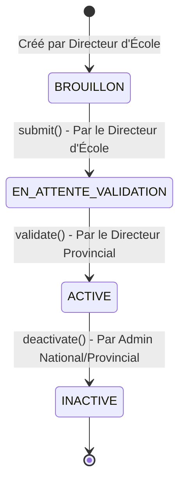
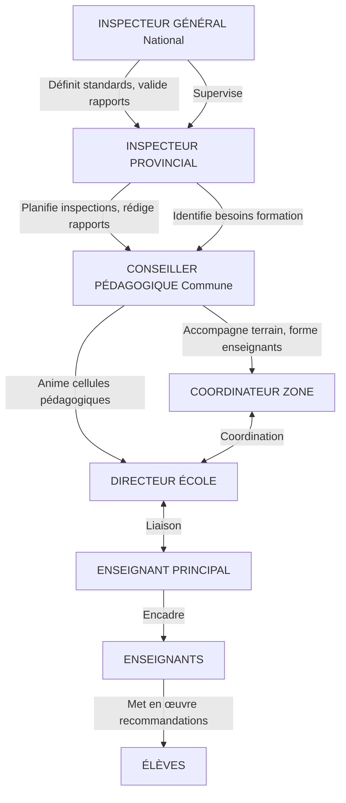
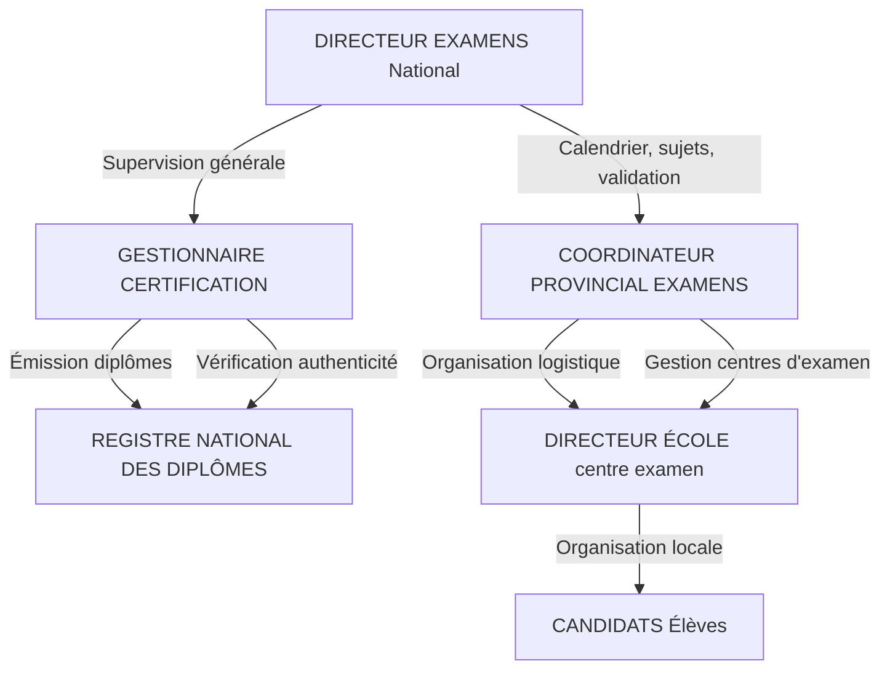
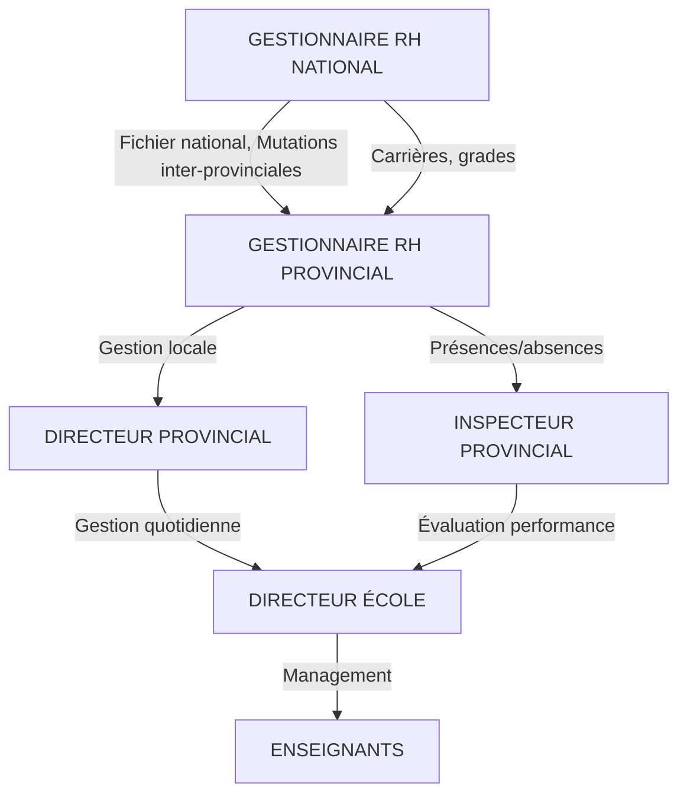
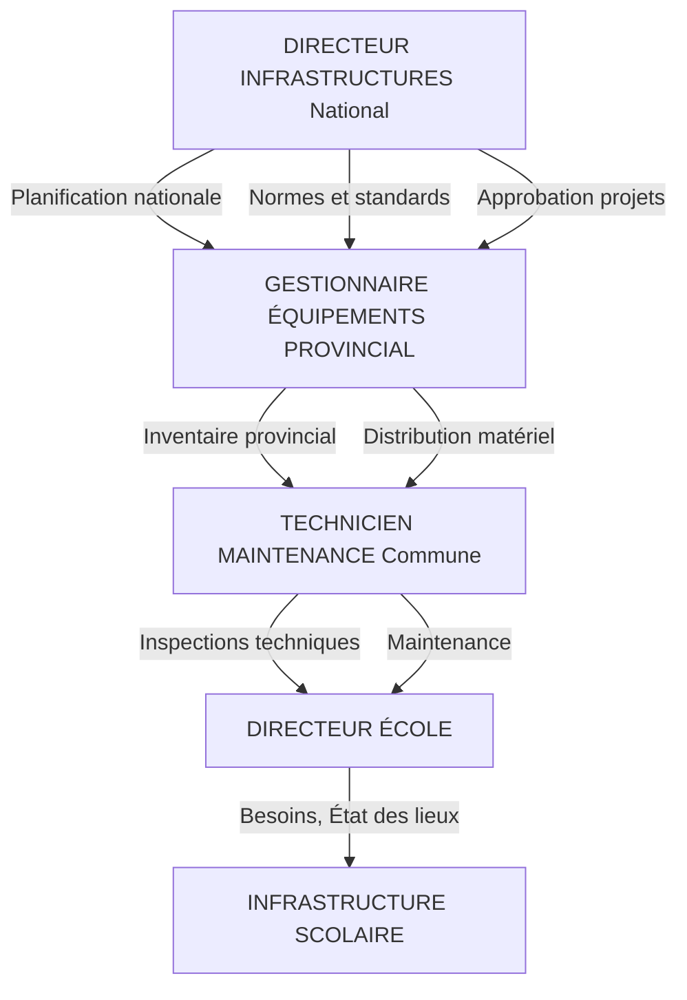

# NEMS - Système de Gestion de l'Éducation Nationale

## Utilisateurs et Rôles du Système

---

## Hiérarchie Administrative

```
PAYS (Country) → MINISTÈRE → PROVINCE → COMMUNE → ZONE → COLLINE → ÉCOLE
```

---

## Rôles et Activités

### 1. ADMIN NATIONAL (Administrateur National)

**Niveau:** PAYS

**Activités:**
- Gestion complète du système à l'échelle nationale
- Création et gestion des provinces
- Gestion des utilisateurs de tous niveaux
- Validation des écoles au niveau national
- Accès à toutes les données du système
- Exportation des données et rapports nationaux
- Configuration des paramètres système

**Permissions:** `view_data`, `create_data`, `update_data`, `delete_data`, `validate_data`, `export_data`, `manage_users`, `manage_schools`

---

### 2. ADMIN MINISTRY (Administrateur Ministériel)

**Niveau:** MINISTÈRE

**Activités:**
- Gestion des données au niveau ministériel
- Supervision des activités des provinces
- Validation des politiques éducatives
- Accès aux rapports consolidés
- Gestion des utilisateurs du ministère

**Permissions:** `view_data`, `create_data`, `update_data`, `validate_data`, `export_data`, `manage_users`

---

### 3. DIRECTOR PROVINCIAL (Directeur Provincial de l'Éducation)

**Niveau:** PROVINCE

**Activités:**
- Supervision des écoles de la province
- Validation des écoles (`EN_ATTENTE_VALIDATION` → `ACTIVE`)
- Gestion des communes de sa province
- Nomination et gestion des officiers communaux
- Rapports provinciaux sur l'éducation
- Suivi des indicateurs de performance provinciale

**Permissions:** `view_data`, `create_data`, `update_data`, `validate_data`, `export_data`, `manage_schools`

---

### 4. COMMUNAL OFFICER (Officier Communal de l'Éducation)

**Niveau:** COMMUNE

**Activités:**
- Gestion des écoles de la commune
- Supervision des zones éducatives
- Collecte et consolidation des données communales
- Coordination avec les superviseurs de zone
- Rapports communaux

**Permissions:** `view_data`, `create_data`, `update_data`, `export_data`

---

### 5. ZONE SUPERVISOR (Superviseur de Zone)

**Niveau:** ZONE

**Activités:**
- Supervision directe des écoles de la zone
- Visites d'inspection des établissements
- Accompagnement pédagogique des directeurs d'école
- Collecte des données de terrain
- Rapports de zone

**Permissions:** `view_data`, `create_data`, `update_data`

---

### 6. SCHOOL DIRECTOR (Directeur d'École)

**Niveau:** SCHOOL (ÉCOLE)

**Activités:**
- Gestion complète de son établissement
- Création et soumission du dossier école (`BROUILLON` → `EN_ATTENTE_VALIDATION`)
- Gestion du personnel enseignant et administratif
- Gestion des élèves et des classes
- Saisie des données scolaires
- Rapports d'établissement

**Permissions:** `view_data`, `create_data`, `update_data`, `manage_schools` (limité)

---

### 7. TEACHER (Enseignant)

**Niveau:** SCHOOL (ÉCOLE)

**Activités:**
- Consultation des données de l'école
- Saisie des notes et évaluations
- Gestion de sa classe
- Suivi des élèves

**Permissions:** `view_data`, `create_data` (limité), `update_data` (limité)

---

### 8. ADMINISTRATIVE STAFF (Personnel Administratif)

**Niveau:** SCHOOL (ÉCOLE)

**Activités:**
- Saisie des données administratives
- Gestion des inscriptions des élèves
- Tenue des registres
- Support administratif au directeur

**Permissions:** `view_data`, `create_data` (limité), `update_data` (limité)

---

## Workflow des Écoles

État des écoles et transitions:



**Légende:**
- **BROUILLON (Draft)**: État initial créé par le Directeur d'École
- **EN_ATTENTE_VALIDATION (Pending)**: En attente de validation
- **ACTIVE**: École validée et opérationnelle
- **INACTIVE**: École désactivée

---

## Permissions Détaillées

| Permission | Description |
|------------|-------------|
| `view_data` | Consulter les données selon son niveau hiérarchique |
| `create_data` | Créer de nouvelles entrées (écoles, utilisateurs, etc.) |
| `update_data` | Modifier les données existantes |
| `delete_data` | Supprimer des données (réservé aux admins) |
| `validate_data` | Valider les soumissions (workflow des écoles) |
| `export_data` | Exporter les données et générer des rapports |
| `manage_users` | Gérer les comptes utilisateurs |
| `manage_schools` | Gérer les établissements scolaires |

---

## Filtrage des Données (HasDataScope)

Chaque utilisateur a accès uniquement aux données de son niveau et en dessous:

| Rôle | Portée des Données |
|------|-------------------|
| **Admin National** | Toutes les données du pays |
| **Admin Ministry** | Données du ministère |
| **Director Provincial** | Données de sa province uniquement |
| **Communal Officer** | Données de sa commune uniquement |
| **Zone Supervisor** | Données de sa zone uniquement |
| **School Director** | Données de son école uniquement |
| **Teacher** | Données de son école uniquement |
| **Administrative Staff** | Données de son école uniquement |

---

## Extension des Rôles - Proposition

Les rôles ci-dessus constituent le noyau du système. La section suivante propose des rôles additionnels pour un système EMIS national complet.

---

# Nouveaux Rôles et Profils Proposés
## Pour un Système EMIS National Complet

---

## Table des Matières

1. [Vue d'ensemble et catégorisation](#i-vue-densemble-et-catégorisation)
2. [Rôles Pédagogiques & Inspection](#ii-rôles-pédagogiques--inspection-a1-a5)
3. [Rôles Examens & Certification](#iii-rôles-examens--certification-b1-b3)
4. [Rôles Planification, Statistiques & M&E](#iv-rôles-planification-statistiques--me-c1-c4)
5. [Rôles Infrastructure & Équipements](#v-rôles-infrastructure--équipements-d1-d3)
6. [Rôles Support Technique EMIS](#vi-rôles-support-technique-emis-e1-e3)
7. [Rôles Partenaires & Observateurs Externes](#vii-rôles-partenaires--observateurs-externes-f1-f4)
8. [Rôles Ressources Humaines Éducation](#viii-rôles-ressources-humaines-éducation-g1-g2)
9. [Matrice des nouvelles permissions](#ix-matrice-des-nouvelles-permissions)
10. [Interactions et flux entre rôles](#x-interactions-et-flux-entre-rôles)
11. [Recommandations d'implémentation](#xi-recommandations-dimplémentation)

---

## I. Vue d'ensemble et catégorisation

### Récapitulatif des nouveaux rôles proposés

| Catégorie | Nombre | Niveaux concernés |
|-----------|--------|-------------------|
| A. Pédagogie & Inspection | 5 | National → Zone |
| B. Examens & Certification | 3 | National → Province |
| C. Planification & Statistiques | 4 | National → Commune |
| D. Infrastructure & Équipements | 3 | National → Commune |
| E. Support Technique EMIS | 3 | National → Province |
| F. Partenaires & Observateurs | 4 | National → Province (externe) |
| G. Ressources Humaines Éducation | 2 | National → Province |
| **TOTAL** | **24** | |

### Classification par type

**RÔLES INTERNES GOUVERNEMENT : 20**
- Superviseurs/Stratégiques : 5
- Opérationnels : 12
- Support technique : 3

**RÔLES EXTERNES : 4**
- Partenaires financiers : 1
- ONG/Société civile : 1
- Recherche : 1
- Audit : 1

---

## II. Rôles Pédagogiques & Inspection (A1-A5)

### A1. Inspecteur Général de l'Éducation (`inspector_general`)

**Niveau administratif:** PAYS (National)  
**Type:** Superviseur / Contrôle qualité  
**Catégorie:** Interne gouvernement

**Responsabilités:**
- Coordination nationale des inspections pédagogiques
- Définition des standards de qualité éducative
- Validation des rapports d'inspection provinciaux
- Élaboration des politiques d'amélioration de la qualité
- Supervision des inspecteurs provinciaux
- Rapport annuel sur la qualité de l'éducation nationale

**Permissions:**
- `view_data` (toutes données nationales)
- `view_inspection_reports`
- `validate_inspection_reports`
- `create_quality_standards` **[NOUVELLE]**
- `export_data`

**Data Scope (HasDataScope):**
- admin_level = PAYS
- Lecture complète sur tout le territoire
- Écriture limitée aux rapports d'inspection et standards qualité

**Interactions:**
- **Supervise:** Inspecteurs Provinciaux
- **Rapporte à:** Ministre de l'Éducation
- **Collabore avec:** Directeur de la Planification, Admin National

---

### A2. Inspecteur Provincial (`provincial_inspector`)

**Niveau administratif:** PROVINCE  
**Type:** Superviseur / Contrôle qualité  
**Catégorie:** Interne gouvernement

**Responsabilités:**
- Planification et exécution des inspections dans la province
- Évaluation des performances des écoles
- Rédaction des rapports d'inspection
- Accompagnement pédagogique des directeurs d'école
- Identification des besoins en formation des enseignants
- Suivi des recommandations d'inspection

**Permissions:**
- `view_data` (données de la province)
- `create_inspection_reports` **[NOUVELLE]**
- `update_inspection_reports`
- `view_teacher_profiles`
- `recommend_training` **[NOUVELLE]**
- `export_data` (province uniquement)

**Data Scope (HasDataScope):**
- admin_level = PROVINCE
- admin_entity_id = province_id attribuée
- Accès en lecture à toutes les écoles de la province
- Accès aux dossiers enseignants (consultation)

**Interactions:**
- **Rapporte à:** Inspecteur Général
- **Supervise:** Conseillers Pédagogiques (commune)
- **Collabore avec:** Directeur Provincial, M&E Officer

---

### A3. Conseiller Pédagogique (`pedagogical_advisor`)

**Niveau administratif:** COMMUNE  
**Type:** Opérationnel / Support pédagogique  
**Catégorie:** Interne gouvernement

**Responsabilités:**
- Accompagnement des enseignants sur le terrain
- Animation des cellules pédagogiques
- Diffusion des nouvelles méthodes d'enseignement
- Organisation des formations continues locales
- Suivi de l'application des programmes scolaires
- Rapport d'activités pédagogiques à l'inspecteur provincial

**Permissions:**
- `view_data` (données de la commune)
- `view_teacher_profiles`
- `create_training_sessions` **[NOUVELLE]**
- `create_pedagogical_reports` **[NOUVELLE]**
- `view_curriculum_data`

**Data Scope (HasDataScope):**
- admin_level = COMMUNE
- admin_entity_id = commune_id attribuée
- Accès aux écoles et enseignants de la commune

**Interactions:**
- **Rapporte à:** Inspecteur Provincial
- **Collabore avec:** Coordinateurs Zone, Directeurs d'école
- **Encadre:** Enseignants principaux, Enseignants

---

### A4. Enseignant Principal / Chef de Discipline (`senior_teacher`)

**Niveau administratif:** ÉCOLE  
**Type:** Pédagogique / Superviseur local  
**Catégorie:** Personnel enseignant

**Responsabilités:**
- Coordination pédagogique d'une discipline ou d'un cycle
- Encadrement des enseignants débutants (mentorat)
- Participation aux évaluations internes
- Liaison avec les conseillers pédagogiques
- Proposition d'améliorations pédagogiques
- Animation des réunions de discipline

**Permissions:**
- `view_data` (données de l'école uniquement)
- `view_teacher_profiles` (même école)
- `create_pedagogical_notes` **[NOUVELLE]**
- `view_student_performance`

**Data Scope (HasDataScope):**
- admin_level = SCHOOL
- admin_entity_id = school_id attribué
- Lecture étendue aux performances de sa discipline

**Interactions:**
- **Rapporte à:** Directeur d'École
- **Collabore avec:** Conseiller Pédagogique
- **Encadre:** Enseignants de la discipline

> [!NOTE]
> Ce rôle est une extension du rôle Enseignant existant, pas un remplacement. Un enseignant peut être promu Enseignant Principal tout en conservant ses fonctions.

---

### A5. Coordinateur de Zone Pédagogique (`zone_pedagogical_coordinator`)

**Niveau administratif:** ZONE  
**Type:** Opérationnel / Coordination  
**Catégorie:** Interne gouvernement

**Responsabilités:**
- Coordination des cellules pédagogiques de la zone
- Organisation des échanges inter-écoles
- Suivi des indicateurs de performance de la zone
- Remontée des besoins pédagogiques vers la commune
- Animation des journées pédagogiques de zone

**Permissions:**
- `view_data` (données de la zone)
- `view_teacher_profiles`
- `create_zone_reports`
- `coordinate_training_sessions`

**Data Scope (HasDataScope):**
- admin_level = ZONE
- admin_entity_id = zone_id attribuée

**Interactions:**
- **Rapporte à:** Conseiller Pédagogique, Superviseur de Zone
- **Collabore avec:** Directeurs d'école de la zone
- **Encadre:** Enseignants principaux

---

## III. Rôles Examens & Certification (B1-B3)

### B1. Directeur des Examens (`exam_director`)

**Niveau administratif:** PAYS (National)  
**Type:** Superviseur / Stratégique  
**Catégorie:** Interne gouvernement

**Responsabilités:**
- Planification du calendrier national des examens
- Supervision de l'élaboration des sujets d'examen
- Coordination des centres d'examen nationaux
- Validation des résultats nationaux
- Gestion de la certification et des diplômes
- Gestion des fraudes et litiges d'examen
- Définition des modalités d'évaluation nationale

**Permissions:**
- `view_data` (national)
- `manage_exam_calendar` **[NOUVELLE]**
- `manage_exam_subjects` **[NOUVELLE]**
- `validate_exam_results` **[NOUVELLE]**
- `issue_certificates` **[NOUVELLE]**
- `export_data`

**Data Scope (HasDataScope):**
- admin_level = PAYS
- Accès complet aux données d'examens
- Accès restreint aux données personnelles (uniquement candidats)

**Interactions:**
- **Rapporte à:** Ministre, Admin National
- **Supervise:** Coordinateurs Provinciaux des Examens
- **Collabore avec:** Gestionnaire de Certification

**Sécurité renforcée:**
- Authentification 2FA obligatoire
- Journalisation complète des accès
- Accès aux sujets limité dans le temps

---

### B2. Coordinateur Provincial des Examens (`provincial_exam_coordinator`)

**Niveau administratif:** PROVINCE  
**Type:** Opérationnel / Coordination  
**Catégorie:** Interne gouvernement

**Responsabilités:**
- Organisation logistique des examens dans la province
- Gestion des centres d'examen provinciaux
- Réception et distribution sécurisée des sujets
- Collecte et transmission des copies
- Supervision de la correction
- Proclamation des résultats provinciaux
- Gestion des incidents d'examen

**Permissions:**
- `view_data` (province)
- `manage_exam_centers` **[NOUVELLE]**
- `view_exam_results` (province)
- `submit_exam_results`
- `export_data` (province)

**Data Scope (HasDataScope):**
- admin_level = PROVINCE
- admin_entity_id = province_id attribuée

**Interactions:**
- **Rapporte à:** Directeur des Examens
- **Collabore avec:** Directeur Provincial, Directeurs d'école (centres)

---

### B3. Gestionnaire de Certification (`certification_manager`)

**Niveau administratif:** PAYS (National)  
**Type:** Opérationnel / Administratif  
**Catégorie:** Interne gouvernement

**Responsabilités:**
- Émission des diplômes et certificats officiels
- Vérification des dossiers de certification
- Gestion des demandes de duplicata
- Maintien du registre national des diplômes
- Authentification des diplômes (employeurs, universités, étranger)
- Lutte contre les faux diplômes

**Permissions:**
- `view_data` (national, lecture seule générale)
- `issue_certificates`
- `verify_certificates` **[NOUVELLE]**
- `manage_diploma_registry` **[NOUVELLE]**

**Data Scope (HasDataScope):**
- admin_level = PAYS
- Accès limité aux données de certification uniquement
- Pas d'accès aux données pédagogiques

**Interactions:**
- **Rapporte à:** Directeur des Examens
- **Collabore avec:** Admin National (vérifications)

---

## IV. Rôles Planification, Statistiques & M&E (C1-C4)

### C1. Directeur de la Planification (`planning_director`)

**Niveau administratif:** PAYS (National)  
**Type:** Stratégique / Décisionnel  
**Catégorie:** Interne gouvernement

**Responsabilités:**
- Élaboration des plans stratégiques de l'éducation (5, 10 ans)
- Projection des besoins (infrastructures, enseignants, équipements)
- Définition des indicateurs de performance (KPIs) nationaux
- Coordination avec les partenaires financiers
- Production des rapports annuels de performance
- Pilotage de la politique sectorielle de l'éducation
- Préparation des revues sectorielles

**Permissions:**
- `view_data` (toutes données agrégées)
- `create_strategic_plans` **[NOUVELLE]**
- `manage_kpis` **[NOUVELLE]**
- `export_data`
- `generate_national_reports` **[NOUVELLE]**

**Data Scope (HasDataScope):**
- admin_level = PAYS
- Accès aux données agrégées uniquement
- Pas d'accès aux données nominatives individuelles

**Interactions:**
- **Rapporte à:** Ministre, Secrétaire Général
- **Collabore avec:** Statisticien National, Directeur Infrastructures
- **Interface avec:** PTF (Partenaires Techniques et Financiers)

---

### C2. Statisticien National (`national_statistician`)

**Niveau administratif:** PAYS (National)  
**Type:** Opérationnel / Technique  
**Catégorie:** Interne gouvernement

**Responsabilités:**
- Collecte et consolidation des données statistiques nationales
- Production de l'annuaire statistique de l'éducation
- Calcul des indicateurs (taux scolarisation, redoublement, achèvement...)
- Réponse aux demandes de données des organismes internationaux
- Contrôle qualité des données remontées des provinces
- Méthodologie de collecte des données

**Permissions:**
- `view_data` (national, données détaillées)
- `validate_data`
- `export_data`
- `create_statistical_reports` **[NOUVELLE]**
- `manage_data_quality` **[NOUVELLE]**

**Data Scope (HasDataScope):**
- admin_level = PAYS
- Accès complet en lecture
- Écriture limitée aux rapports statistiques

**Interactions:**
- **Rapporte à:** Directeur de la Planification
- **Collabore avec:** M&E Officers provinciaux
- **Interface avec:** Institut National de Statistique

---

### C3. Chargé de Suivi-Évaluation / M&E Officer (`me_officer`)

**Niveau administratif:** PROVINCE  
**Type:** Opérationnel / Analytique  
**Catégorie:** Interne gouvernement

**Responsabilités:**
- Suivi des indicateurs de performance provinciaux
- Collecte et vérification des données de terrain
- Analyse des écarts et des tendances
- Production de tableaux de bord provinciaux
- Alerte précoce sur les problèmes de performance
- Suivi des projets éducatifs provinciaux

**Permissions:**
- `view_data` (province)
- `create_data` (rapports M&E)
- `export_data` (province)
- `create_dashboards` **[NOUVELLE]**
- `send_alerts` **[NOUVELLE]**

**Data Scope (HasDataScope):**
- admin_level = PROVINCE
- admin_entity_id = province_id attribuée

**Interactions:**
- **Rapporte à:** Statisticien National, Directeur Provincial
- **Collabore avec:** Inspecteur Provincial, Collecteurs de données
- **Interface avec:** PTF pour indicateurs de projets

---

### C4. Collecteur de Données (`data_collector`)

**Niveau administratif:** COMMUNE  
**Type:** Opérationnel / Terrain  
**Catégorie:** Interne gouvernement

**Responsabilités:**
- Collecte des données de recensement scolaire annuel
- Vérification des données soumises par les écoles
- Saisie et mise à jour des données dans le système
- Rapport des incohérences détectées
- Appui aux écoles pour la saisie des données

**Permissions:**
- `view_data` (commune)
- `create_data` (données de collecte)
- `update_data` (corrections de données)
- `flag_data_issues` **[NOUVELLE]**

**Data Scope (HasDataScope):**
- admin_level = COMMUNE
- admin_entity_id = commune_id attribuée

**Interactions:**
- **Rapporte à:** M&E Officer provincial
- **Collabore avec:** Officier Communal, Directeurs d'école

---

## V. Rôles Infrastructure & Équipements (D1-D3)

### D1. Directeur des Infrastructures Scolaires (`infrastructure_director`)

**Niveau administratif:** PAYS (National)  
**Type:** Stratégique / Gestion  
**Catégorie:** Interne gouvernement

**Responsabilités:**
- Cartographie nationale des infrastructures scolaires
- Planification des constructions et réhabilitations
- Gestion du budget d'investissement infrastructures
- Suivi des chantiers et des projets de construction
- Définition des normes et standards des bâtiments scolaires
- Coordination avec les bailleurs pour les projets infrastructure

**Permissions:**
- `view_data` (infrastructures national)
- `manage_infrastructure` **[NOUVELLE]**
- `approve_construction_projects` **[NOUVELLE]**
- `export_data`

**Data Scope (HasDataScope):**
- admin_level = PAYS
- Accès aux données d'infrastructure de toutes les écoles
- Pas d'accès aux données pédagogiques

**Interactions:**
- **Rapporte à:** Secrétaire Général, Directeur Planification
- **Supervise:** Gestionnaires Provinciaux d'Équipements
- **Collabore avec:** PTF pour projets de construction

---

### D2. Gestionnaire Provincial d'Équipements (`provincial_equipment_manager`)

**Niveau administratif:** PROVINCE  
**Type:** Opérationnel / Logistique  
**Catégorie:** Interne gouvernement

**Responsabilités:**
- Inventaire des équipements scolaires de la province
- Distribution du matériel pédagogique et mobilier
- Suivi de l'état des équipements
- Gestion des demandes d'équipement des écoles
- Rapport des besoins en équipements au niveau national

**Permissions:**
- `view_data` (équipements province)
- `manage_equipment` **[NOUVELLE]**
- `create_equipment_requests`
- `approve_equipment_distribution`

**Data Scope (HasDataScope):**
- admin_level = PROVINCE
- admin_entity_id = province_id attribuée

**Interactions:**
- **Rapporte à:** Directeur des Infrastructures
- **Collabore avec:** Directeur Provincial, Techniciens de maintenance

---

### D3. Technicien de Maintenance Scolaire (`school_maintenance_technician`)

**Niveau administratif:** COMMUNE  
**Type:** Opérationnel / Technique  
**Catégorie:** Interne gouvernement

**Responsabilités:**
- Inspection technique des bâtiments scolaires
- Maintenance préventive et corrective
- Rapport de l'état des infrastructures
- Coordination des interventions de réparation
- Évaluation des besoins en réhabilitation

**Permissions:**
- `view_data` (infrastructures commune)
- `create_maintenance_reports` **[NOUVELLE]**
- `update_infrastructure_status`

**Data Scope (HasDataScope):**
- admin_level = COMMUNE
- admin_entity_id = commune_id attribuée

**Interactions:**
- **Rapporte à:** Gestionnaire Provincial d'Équipements
- **Collabore avec:** Officier Communal, Directeurs d'école

---

## VI. Rôles Support Technique EMIS (E1-E3)

### E1. Administrateur Système EMIS (`emis_system_admin`)

**Niveau administratif:** PAYS (National)  
**Type:** Technique / Infrastructure IT  
**Catégorie:** Interne gouvernement - IT

**Responsabilités:**
- Administration technique de la plateforme NEMS
- Gestion des serveurs, bases de données, sauvegardes
- Sécurité informatique et gestion des accès
- Déploiement des mises à jour et correctifs
- Support technique niveau 3 (escalade)
- Monitoring et performance du système

**Permissions:**
- `manage_users`
- `manage_system_config` **[NOUVELLE]**
- `view_audit_logs` **[NOUVELLE]**
- `manage_backups` **[NOUVELLE]**
- `manage_api_keys` **[NOUVELLE]**

**Data Scope (HasDataScope):**
- admin_level = PAYS
- Accès technique complet aux systèmes
- PAS d'accès aux données métier sensibles (examens, résultats...)

**Interactions:**
- **Rapporte à:** DSI Ministère
- **Collabore avec:** Admin National, Formateurs EMIS
- **Support:** Tous les utilisateurs du système

**Sécurité:**
- Authentification forte obligatoire
- Actions journalisées
- Séparation des environnements (prod/test)

---

### E2. Formateur EMIS (`emis_trainer`)

**Niveau administratif:** PROVINCE  
**Type:** Support / Formation  
**Catégorie:** Interne gouvernement - IT

**Responsabilités:**
- Formation des utilisateurs au système NEMS
- Support utilisateur niveau 1 et 2
- Création de documentation et guides utilisateurs
- Remontée des bugs et demandes d'amélioration
- Accompagnement lors des campagnes de collecte de données

**Permissions:**
- `view_data` (province, lecture seule)
- `create_training_materials` **[NOUVELLE]**
- `reset_user_passwords` (province)
- `view_user_activity_logs`

**Data Scope (HasDataScope):**
- admin_level = PROVINCE
- admin_entity_id = province_id attribuée

**Interactions:**
- **Rapporte à:** Admin Système EMIS
- **Collabore avec:** Directeur Provincial, tous utilisateurs province

---

### E3. Support Helpdesk EMIS (`emis_helpdesk`)

**Niveau administratif:** PAYS (National)  
**Type:** Support / Opérationnel  
**Catégorie:** Interne gouvernement - IT

**Responsabilités:**
- Réception et traitement des tickets de support
- Diagnostic des problèmes utilisateurs
- Escalade vers les niveaux supérieurs
- Documentation des incidents et solutions
- Suivi de la satisfaction utilisateur

**Permissions:**
- `view_data` (limité aux besoins de diagnostic)
- `manage_support_tickets` **[NOUVELLE]**
- `reset_user_passwords`
- `view_user_profiles`

**Data Scope (HasDataScope):**
- admin_level = PAYS
- Accès restreint aux données nécessaires au support

**Interactions:**
- **Rapporte à:** Admin Système EMIS
- **Collabore avec:** Formateurs EMIS
- **Support:** Tous les utilisateurs

---

## VII. Rôles Partenaires & Observateurs Externes (F1-F4)

> [!IMPORTANT]
> Ces rôles sont réservés aux utilisateurs EXTERNES au Ministère. Ils ont des droits LIMITÉS et principalement en LECTURE SEULE. L'attribution de ces rôles nécessite une validation Admin National.

### F1. Partenaire Technique et Financier - PTF (`donor_partner`)

**Niveau administratif:** PAYS ou PROVINCE (configurable selon projet)  
**Type:** Externe / Observateur  
**Catégorie:** Partenaire externe

**Responsabilités:**
- Suivi des indicateurs des projets financés
- Consultation des données de performance
- Production de rapports pour leurs institutions
- Pas d'intervention dans les opérations

**Permissions:**
- `view_data` (données agrégées, selon périmètre du projet)
- `export_data` (agrégé uniquement)
- `view_project_indicators` **[NOUVELLE]**

**⚠️ LECTURE SEULE - AUCUNE PERMISSION D'ÉCRITURE**

**Data Scope (HasDataScope):**
- Configurable selon la convention de partenariat
- Typiquement limité à certaines provinces ou indicateurs spécifiques
- JAMAIS d'accès aux données nominatives des élèves/enseignants

**Interactions:**
- **Interface avec:** Directeur Planification, M&E Officers
- **Rapporte à:** Leur organisation (externe)

**Exemples de PTF:**
- Banque Mondiale
- UNICEF
- UNESCO
- GPE (Global Partnership for Education)
- Coopérations bilatérales

---

### F2. Observateur ONG / Société Civile (`ngo_observer`)

**Niveau administratif:** PROVINCE ou COMMUNE  
**Type:** Externe / Observateur  
**Catégorie:** Partenaire externe

**Responsabilités:**
- Suivi des projets éducatifs locaux
- Consultation des données publiques de performance
- Appui aux activités éducatives locales

**Permissions:**
- `view_data` (données publiques agrégées uniquement)
- `view_public_statistics`

**⚠️ LECTURE SEULE TRÈS LIMITÉE**

**Data Scope (HasDataScope):**
- admin_level variable selon convention
- Données publiques uniquement
- Aucun accès aux données individuelles

**Interactions:**
- **Interface avec:** Officier Communal, Superviseur Zone
- **Rapport:** Leur organisation (externe)

---

### F3. Chercheur / Universitaire (`researcher`)

**Niveau administratif:** PAYS (National)  
**Type:** Externe / Recherche  
**Catégorie:** Partenaire externe

**Responsabilités:**
- Recherche en sciences de l'éducation
- Analyse de données pour études académiques
- Publication d'articles et rapports de recherche

**Permissions:**
- `view_data` (données anonymisées/agrégées)
- `export_anonymized_data` **[NOUVELLE]**

**⚠️ LECTURE SEULE, DONNÉES ANONYMISÉES UNIQUEMENT**

**Data Scope (HasDataScope):**
- Selon convention de recherche
- Accès temporaire et audité
- Données anonymisées obligatoirement

**Conditions d'accès:**
- Convention de recherche signée
- Approbation comité éthique
- Durée limitée
- Audit des exports

**Interactions:**
- **Interface avec:** Statisticien National
- **Validation:** Admin National

---

### F4. Auditeur Externe (`external_auditor`)

**Niveau administratif:** PAYS (National)  
**Type:** Externe / Contrôle  
**Catégorie:** Contrôle externe

**Responsabilités:**
- Audit des processus et de la qualité des données
- Vérification de la conformité aux normes
- Production de rapports d'audit
- Recommandations d'amélioration

**Permissions:**
- `view_data` (complet en lecture)
- `view_audit_logs`
- `export_data` (pour audit)
- `view_system_config`

**⚠️ LECTURE SEULE ÉTENDUE, TEMPS LIMITÉ**

**Data Scope (HasDataScope):**
- admin_level = PAYS
- Accès temporaire selon mission d'audit
- Toutes actions tracées et auditées

**Conditions d'accès:**
- Lettre de mission officielle
- Durée strictement limitée
- Supervision par Admin National
- Journalisation complète

---

## VIII. Rôles Ressources Humaines Éducation (G1-G2)

### G1. Gestionnaire RH Enseignants - National (`teacher_hr_manager`)

**Niveau administratif:** PAYS (National)  
**Type:** Administratif / RH  
**Catégorie:** Interne gouvernement

**Responsabilités:**
- Gestion du fichier national des enseignants
- Suivi des affectations et mutations
- Gestion des carrières (avancements, grades)
- Planification des besoins en recrutement
- Interface avec la fonction publique
- Gestion de la masse salariale enseignants

**Permissions:**
- `view_data` (enseignants national)
- `manage_teacher_profiles` **[NOUVELLE]**
- `manage_teacher_assignments` **[NOUVELLE]**
- `manage_teacher_careers` **[NOUVELLE]**
- `export_data`

**Data Scope (HasDataScope):**
- admin_level = PAYS
- Accès complet aux dossiers enseignants
- Pas d'accès aux données élèves

**Interactions:**
- **Rapporte à:** DRH Ministère
- **Collabore avec:** Directeur Planification
- **Interface avec:** Fonction Publique, Finances

---

### G2. Gestionnaire RH Provincial (`provincial_hr_officer`)

**Niveau administratif:** PROVINCE  
**Type:** Administratif / RH  
**Catégorie:** Interne gouvernement

**Responsabilités:**
- Gestion des enseignants de la province
- Préparation des dossiers de mutation
- Suivi des présences et absences
- Gestion des remplacements temporaires
- Remontée des besoins en personnel au national

**Permissions:**
- `view_data` (enseignants province)
- `update_teacher_profiles` (province)
- `manage_attendance` **[NOUVELLE]**
- `request_teacher_transfers`
- `export_data` (province)

**Data Scope (HasDataScope):**
- admin_level = PROVINCE
- admin_entity_id = province_id attribuée

**Interactions:**
- **Rapporte à:** Gestionnaire RH National
- **Collabore avec:** Directeur Provincial

---

## IX. Matrice des Nouvelles Permissions

### Permissions existantes à réutiliser

| Permission | Description |
|------------|-------------|
| `view_data` | Visualiser les données selon le scope |
| `create_data` | Créer de nouvelles entrées |
| `update_data` | Modifier les données existantes |
| `delete_data` | Supprimer des données |
| `validate_data` | Valider/approuver des données |
| `export_data` | Exporter les données |
| `manage_users` | Gérer les comptes utilisateurs |
| `manage_schools` | Gérer les écoles (CRUD + workflow) |

### Nouvelles permissions proposées

#### Inspection & Qualité

| Permission | Description |
|------------|-------------|
| `create_quality_standards` | Définir les standards de qualité éducative |
| `create_inspection_reports` | Créer des rapports d'inspection |
| `validate_inspection_reports` | Valider les rapports d'inspection |
| `recommend_training` | Recommander des formations pour enseignants |
| `view_inspection_reports` | Consulter les rapports d'inspection |

#### Pédagogie & Formation

| Permission | Description |
|------------|-------------|
| `create_training_sessions` | Organiser des sessions de formation |
| `create_pedagogical_reports` | Rédiger des rapports pédagogiques |
| `create_pedagogical_notes` | Créer des notes pédagogiques (école) |
| `view_teacher_profiles` | Consulter les profils enseignants |
| `view_curriculum_data` | Consulter les programmes scolaires |
| `view_student_performance` | Consulter les performances élèves |
| `coordinate_training_sessions` | Coordonner les formations de zone |
| `create_zone_reports` | Créer des rapports de zone |

#### Examens & Certification

| Permission | Description |
|------------|-------------|
| `manage_exam_calendar` | Gérer le calendrier des examens |
| `manage_exam_subjects` | Gérer les sujets d'examen |
| `validate_exam_results` | Valider les résultats d'examen |
| `issue_certificates` | Émettre des diplômes et certificats |
| `verify_certificates` | Vérifier l'authenticité des diplômes |
| `manage_diploma_registry` | Gérer le registre national des diplômes |
| `manage_exam_centers` | Gérer les centres d'examen |
| `submit_exam_results` | Soumettre les résultats d'examen |
| `view_exam_results` | Consulter les résultats d'examen |

#### Planification & Statistiques

| Permission | Description |
|------------|-------------|
| `create_strategic_plans` | Créer des plans stratégiques |
| `manage_kpis` | Gérer les indicateurs de performance |
| `generate_national_reports` | Générer des rapports nationaux |
| `create_statistical_reports` | Créer des rapports statistiques |
| `manage_data_quality` | Gérer le contrôle qualité des données |
| `create_dashboards` | Créer des tableaux de bord |
| `send_alerts` | Envoyer des alertes de performance |
| `flag_data_issues` | Signaler des problèmes de données |

#### Infrastructure & Équipements

| Permission | Description |
|------------|-------------|
| `manage_infrastructure` | Gérer les données d'infrastructure |
| `approve_construction_projects` | Approuver les projets de construction |
| `manage_equipment` | Gérer les équipements scolaires |
| `create_maintenance_reports` | Créer des rapports de maintenance |
| `update_infrastructure_status` | Mettre à jour l'état des infrastructures |
| `create_equipment_requests` | Créer des demandes d'équipement |
| `approve_equipment_distribution` | Approuver la distribution d'équipement |

#### Système & Support

| Permission | Description |
|------------|-------------|
| `manage_system_config` | Configurer les paramètres système |
| `view_audit_logs` | Consulter les journaux d'audit |
| `manage_backups` | Gérer les sauvegardes |
| `manage_api_keys` | Gérer les clés API |
| `create_training_materials` | Créer du matériel de formation |
| `manage_support_tickets` | Gérer les tickets de support |
| `reset_user_passwords` | Réinitialiser les mots de passe |
| `view_user_activity_logs` | Consulter les logs d'activité utilisateur |
| `view_user_profiles` | Consulter les profils utilisateurs |

#### Partenaires & Accès Externes

| Permission | Description |
|------------|-------------|
| `view_project_indicators` | Consulter les indicateurs de projets |
| `export_anonymized_data` | Exporter des données anonymisées |
| `view_public_statistics` | Consulter les statistiques publiques |
| `view_system_config` | Consulter la configuration (audit) |

#### Ressources Humaines

| Permission | Description |
|------------|-------------|
| `manage_teacher_profiles` | Gérer les profils des enseignants |
| `manage_teacher_assignments` | Gérer les affectations des enseignants |
| `manage_teacher_careers` | Gérer les carrières (grades, avancements) |
| `manage_attendance` | Gérer les présences/absences |
| `request_teacher_transfers` | Demander des mutations d'enseignants |

**TOTAL: 54 nouvelles permissions proposées**

---

## X. Interactions et Flux entre Rôles

### Circuit d'Inspection Pédagogique



### Circuit des Examens et Certification



### Circuit des Données Statistiques


### Circuit RH Enseignants



### Circuit Infrastructure & Équipements



### Matrice d'Interaction Rôle ↔ École

| Rôle | Type d'Interaction avec l'École |
|------|--------------------------------|
| Inspecteur Provincial | Visite, évalue, rédige rapport, recommande |
| Conseiller Pédagogique | Accompagne, forme sur place, observe classes |
| Coordinateur Zone | Coordonne cellules pédagogiques, échanges |
| Enseignant Principal | Encadre discipline, évalue pairs (interne) |
| Coord. Provincial Examens | Désigne centres, supervise épreuves |
| Gestionnaire Équipements | Livre matériel, inventorie |
| Technicien Maintenance | Inspecte bâtiments, répare |
| Collecteur Données | Vérifie données, collecte recensement |
| M&E Officer | Analyse performance, alerte problèmes |
| Formateur EMIS | Forme utilisateurs système |
| Gestionnaire RH Provincial | Suivi personnel, mutations |
| PTF / ONG (externe) | Observe uniquement (pas d'intervention) |

---

## XI. Recommandations d'Implémentation

### Priorités de Déploiement

| Phase | Rôles à Implémenter | Justification |
|-------|---------------------|---------------|
| **1** | • Inspecteur Provincial<br>• Statisticien National<br>• M&E Officer<br>• Administrateur Système EMIS | Contrôle qualité<br>Données essentielles<br>Suivi performance<br>Support technique |
| **2** | • Directeur Examens<br>• Coordinateur Provincial Examens<br>• Gestionnaire RH Enseignants<br>• Collecteur Données | Certification<br>Examens provinciaux<br>Gestion personnel<br>Qualité données |
| **3** | • Conseiller Pédagogique<br>• Directeur Infrastructures<br>• Formateur EMIS<br>• Partenaire PTF | Accompagnement terrain<br>Gestion patrimoine<br>Adoption système<br>Transparence |
| **4** | • Inspecteur Général<br>• Directeur Planification<br>• Gestionnaire Certification<br>• Autres rôles spécialisés | Gouvernance nationale<br>Vision stratégique<br>Diplômes<br>Complétude système |

### Bonnes Pratiques Internationales Appliquées

#### 1. Séparation des Préoccupations
- Rôles pédagogiques distincts des rôles administratifs
- Inspection indépendante de la gestion opérationnelle
- RH séparé des fonctions pédagogiques

#### 2. Principe du Moindre Privilège
- Chaque rôle n'a que les permissions strictement nécessaires
- Partenaires externes en lecture seule uniquement
- Accès aux données personnelles limité au minimum

#### 3. Traçabilité et Audit
- Tous les accès sont journalisés
- Rôle d'auditeur externe prévu
- Actions critiques (examens, certifications) doublement tracées

#### 4. Scalabilité
- Hiérarchie PAYS→ÉCOLE maintenue uniformément
- HasDataScope appliqué à tous les nouveaux rôles
- Permissions modulaires et réutilisables

#### 5. Protection des Données
- Données nominatives protégées strictement
- Export anonymisé pour chercheurs
- Agrégation obligatoire pour partenaires externes

### Modifications Techniques Requises (Laravel)

1. **Extension du seeder de permissions:**
   - `database/seeders/PermissionSeeder.php`

2. **Extension du seeder de rôles:**
   - `database/seeders/RoleSeeder.php`

3. **Nouvelles migrations (optionnel):**
   - Table `inspections`
   - Table `exam_results`
   - Table `equipment_inventory`
   - Table `support_tickets`

4. **Extension du trait HasDataScope:**
   - Support des nouveaux modules (inspections, examens, etc.)

5. **Nouvelles Policies:**
   - `InspectionPolicy`
   - `ExamPolicy`
   - `EquipmentPolicy`
   - etc.

### Considérations de Sécurité

#### 1. Authentification Forte pour Rôles Sensibles
- **Examens:** 2FA obligatoire
- **Certification:** 2FA + approbation manager
- **Admin Système:** 2FA + IP autorisées

#### 2. Accès Temporaires pour Externes
- **Auditeurs:** expiration automatique
- **Chercheurs:** durée limitée selon convention
- Révision périodique obligatoire

#### 3. Ségrégation des Données Examens
- Données d'examen isolées pendant sessions
- Accès aux sujets limité et tracé
- Environnement séparé possible

#### 4. Audit Trail Complet
- Qui a accédé à quoi, quand
- Conservation longue durée (5+ ans)
- Alertes sur accès anormaux

---

## Synthèse Finale

| Catégorie | Rôles | Internes | Externes |
|-----------|-------|----------|----------|
| A. Pédagogie & Inspection | 5 | 5 | 0 |
| B. Examens & Certification | 3 | 3 | 0 |
| C. Planification & Statistiques | 4 | 4 | 0 |
| D. Infrastructure & Équipements | 3 | 3 | 0 |
| E. Support Technique EMIS | 3 | 3 | 0 |
| F. Partenaires & Observateurs | 4 | 0 | 4 |
| G. Ressources Humaines | 2 | 2 | 0 |
| **TOTAL** | **24** | **20** | **4** |

### Résumé Global

- **Rôles existants préservés:** 8 rôles (Admin National → Staff)
- **Nouvelles permissions:** 54 permissions groupées en 9 domaines
- **Workflow école:** Non modifié (DRAFT→PENDING→ACTIVE)
- **Hiérarchie administrative:** Préservée intégralement
- **HasDataScope:** Étendu à tous les nouveaux rôles
- **TOTAL RÔLES SYSTÈME:** 32 rôles (8 existants + 24 nouveaux)

---

**Document préparé pour:** Ministère de l'Éducation Nationale - Burundi  
**Système:** NEMS (National Education Management System)  
**Version:** 2.0 (Extension des rôles)  
**Date:** Janvier 2026
